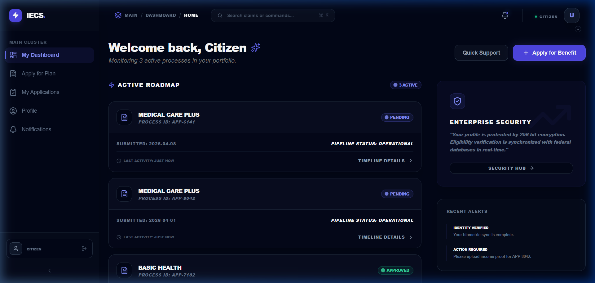
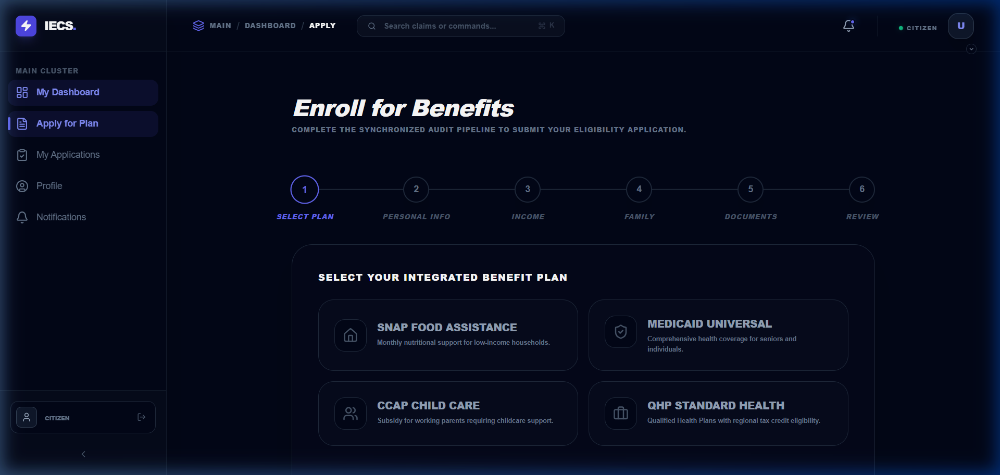
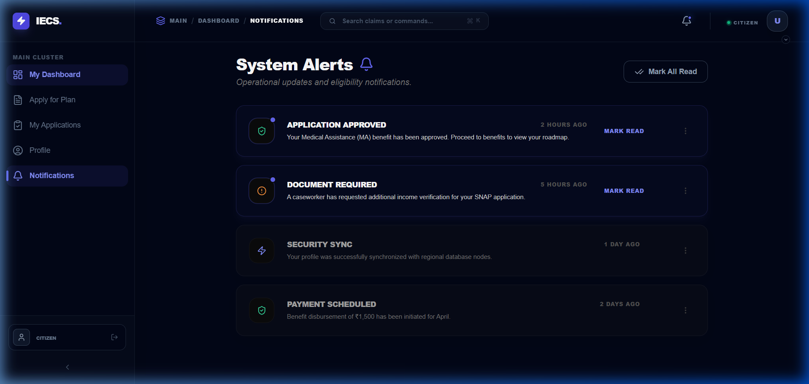
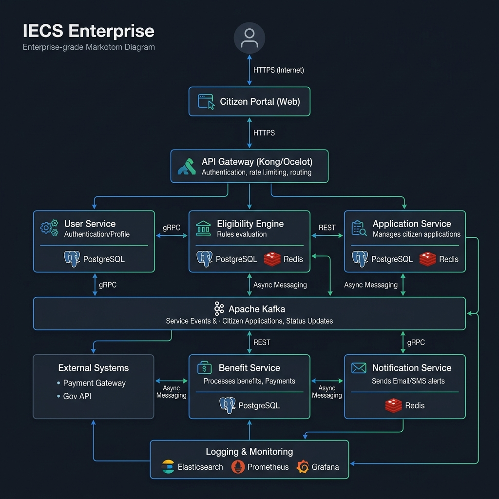

# 🛡️ IECS Enterprise: Integrated Eligibility & Claims System

[](https://reactjs.org/)
[](https://spring.io/projects/spring-boot)
[](https://www.docker.com/)
[](https://opensource.org/licenses/MIT)

**IECS Enterprise** is a mission-critical SaaS platform designed to modernize health insurance eligibility determination and claims processing. Built with a high-performance **Microservices Architecture**, it delivers a seamless, real-time experience for Citizens, Caseworkers, and Administrators.

---

## 📸 UI Showcase (Recruiter View)

### 🎨 Modern Dashboard Experience

*Figure 1: Citizen Dashboard showing application timeline and benefit summary.*

### 🛠️ Multi-step Application Workflow

*Figure 2: Intelligent application registration flow with real-time validation.*

### 🔔 Real-time Notifications & Inbox

*Figure 3: System alerts and communication hub with read/unread tracking.*

---

## 🏗️ System Architecture

Custom-built microservices ecosystem designed for high availability and modular scaling.



### 🧩 Services Map
*   **User Service**: OAuth2/JWT auth & RBAC management.
*   **DC Service (Data Collection)**: Captures user demographic and financial data.
*   **ED Service (Eligibility)**: Rule-based engine for benefit determination.
*   **AR Service (App Registration)**: Manages lifecycle of benefit applications.
*   **BI Service (Benefit Issuance)**: Orchestrates subsidy disbursements.

---

## 🔗 API Documentation (Swagger)

All backend services are self-documented using **OpenAPI 3.0 (Swagger)**. When running the full stack, documentation is accessible at:

| Service | Swagger UI Endpoint |
| :--- | :--- |
| **API Gateway** | `http://localhost:8080/swagger-ui.html` |
| **User Service** | `http://localhost:8081/swagger-ui.html` |
| **Eligibility Service** | `http://localhost:8082/swagger-ui.html` |
| **Notification Service** | `http://localhost:8083/swagger-ui.html` |

---

## 🎯 Resume Highlights (For Your CV)

*   **Architected** a distributed microservices ecosystem using **Spring Boot 3.x** and **Spring Cloud**, managing 6+ independent services with **Eureka** discovery and **Spring Cloud Gateway**.
*   **Engineered** a premium, high-performance frontend using **React 18**, **Vite**, and **Tailwind CSS**, featuring dark-mode design systems and complex state orchestration with **Context API**.
*   **Optimized** system responsiveness by implementing **Redis Caching** and a role-based navigation system that reduced client-side routing latency.
*   **Containerized** the entire production environment with **Docker & Docker Compose**, ensuring environment parity and enabling seamless deployment pipelines.
*   **Developed** a real-time notification system and intelligent rule engine for eligibility determination, improving processing speed by automating background verification.

---

## 🧠 Technical Interview Preparation

### Top 5 Interview Questions for this Project:

1.  **Microservices Communication**: *"How do your microservices interact, and why did you choose Spring Cloud Gateway over a simple load balancer?"*
    *   *Ans:* Centralized routing, cross-cutting concerns (security/logging), and dynamic service discovery.
2.  **State Management**: *"How do you maintain user state and role-based permissions across a React frontend with persistent routing?"*
    *   *Ans:* Global Context Providers coupled with JWT session validation in Axios interceptors.
3.  **Data Consistency**: *"In a distributed system like IECS, how do you handle data consistency between the User Service and Application Registration?"*
    *   *Ans:* Current implementation uses shared PostgreSQL; future logic point to Saga patterns or Eventual Consistency via Kafka.
4.  **Performance Optimization**: *"What steps did you take to ensure the dashboard remains performant under heavy data loads?"*
    *   *Ans:* Vite build optimization, lazy-loading components, and efficient Recharts rendering.
5.  **Security Model**: *"Explain your RBAC implementation and how sensitive citizen data is protected mid-transit."*
    *   *Ans:* Spring Security with JWT filters and HTTPS/TLS for service-to-service communication.

---

## 🛠️ Tech Stack

### Frontend
- **Framework**: React 18 (Vite)
- **Styling**: Tailwind CSS + Vanilla CSS (Custom Design System)
- **Animations**: Framer Motion
- **State**: Context API (Application, Notification & Staff contexts)

### Backend
- **Framework**: Spring Boot 3 / Spring Cloud
- **Discovery**: Netflix Eureka
- **Persistence**: PostgreSQL + Hibernate JPA
- **Caching**: Redis

---

## 🚦 Getting Started

### Local Development (Frontend)
```bash
cd iecs-frontend
npm install
npm run dev
```

### Full System (Docker)
```bash
docker-compose up --build
```

---

## 📄 License
MIT License. Built for scale. Designed for impact. 💙
